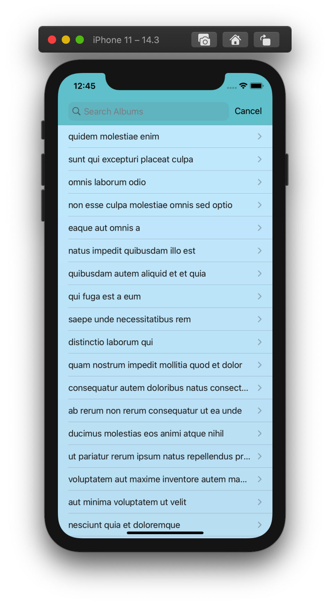
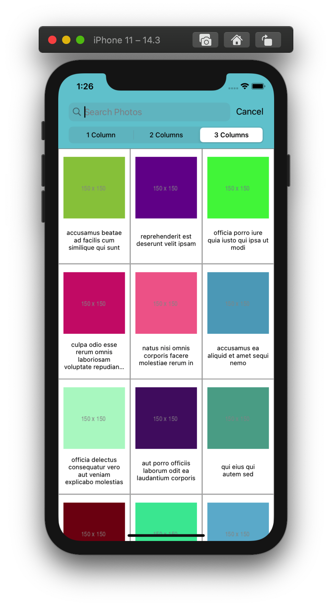
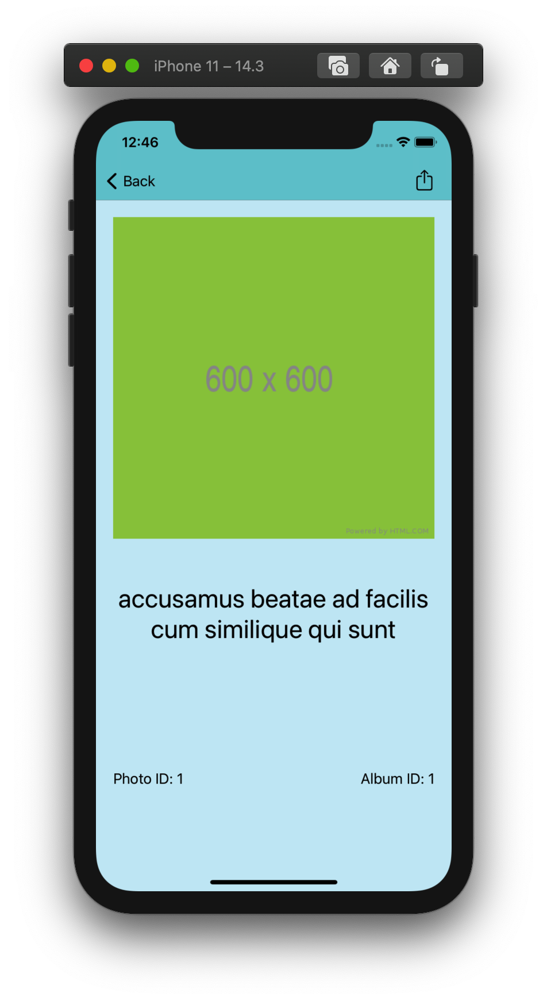

<h1 align="center"> Filma </h1>  

  

  Photo app to save all your pictures!

<!-- START doctoc generated TOC please keep comment here to allow auto update -->
<!-- DON'T EDIT THIS SECTION, INSTEAD RE-RUN doctoc TO UPDATE -->
## Table of Contents

- [Introduction](#introduction)
- [Motivation](#motivation)
- [Screenshots](#screenshots)
- [Tech/framework used](#tech/framework-used)
- [Features](#features)

<!-- END doctoc generated TOC please keep comment here to allow auto update -->

## Introduction

[![Swift Version][swift-image]][swift-url]

Filma is a sample photo album app created using <a href="https://jsonplaceholder.typicode.com/">JSON placeholder</a>'s API.

## Motivation

This app was created as part of <a href="https://www.mediamonks.com/">MediaMonks'</a> recruiting process with the purpose of showing my Swift coding skills.

## Screenshots

## Tech/framework used
Built with:

- Swift
- Alamofire
- SwiftyJSON
- SDWebImage

## Features

A few of the things you can do with Filma:

* Navigate through all 50 albums and their respective pictures
* Use the search bar to look for albums and pictures
* Change the number of columns in CollectionViewController
* Share or save all 1,000 pictures.

[swift-image]:https://img.shields.io/badge/swift-5.3-orange.svg
[swift-url]: https://swift.org/